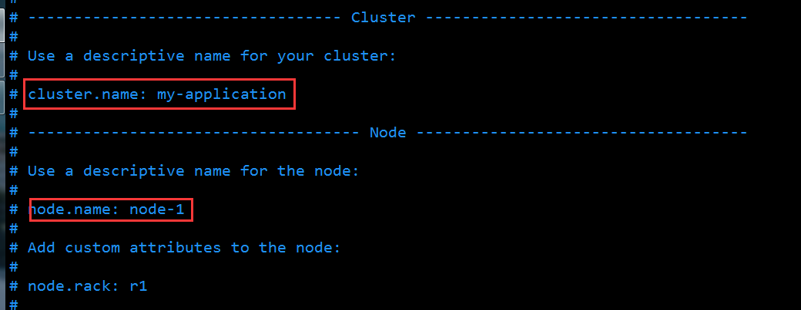

# Installation

**安装Elasticsearch_v2.3.4环境**

## Step 
* 安装ES
  * 下载2.3.4版本ES
  ```
    wget https://download.elastic.co/elasticsearch/release/org/elasticsearch/distribution/zip/elasticsearch/2.3.4/elasticsearch-2.3.4.zip
    
  ```
  * 解压缩，生成`elasticsearch-2.3.4`的目录
  ```
    unzip elasticsearch-2.3.4.zip
  ```
  * 进入生成的目录，修改配置
    * 进入目录 
    ```
      cd elasticsearch-2.3.4
      vim config/elasticsearch.yml
    ```
    
    * 修改配置，#为注释
    ```
      cluster.name: diandainfo #es运行时进程名
      
      node.name:exp-1 #节点名称，每个节点不同，可根据环境+序号构成
      
      

    ```
    
