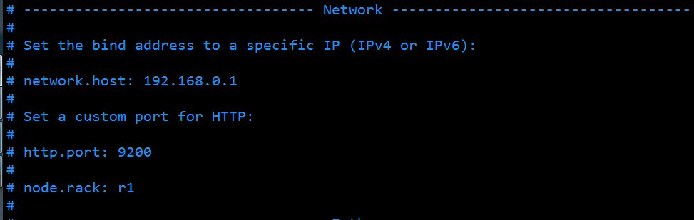

# Installation

**安装Elasticsearch_v2.3.4环境**

## Step 
1. 安装ES
  * 下载2.3.4版本ES
  ```
    wget https://download.elastic.co/elasticsearch/release/org/elasticsearch/distribution/zip/elasticsearch/2.3.4/elasticsearch-2.3.4.zip
    
  ```
  * 解压缩，生成`elasticsearch-2.3.4`的目录
  ```
    unzip elasticsearch-2.3.4.zip
  ```
  * 进入生成的目录，修改配置，**`#为注释`**
    * 进入目录 
    ```
      cd elasticsearch-2.3.4
      vim config/elasticsearch.yml
    ```
    * 修改配置，`key: value`的":"后边加一个" "(空格)
    
    
    ```
      cluster.name: diandainfo                       # es运行时进程名
      
      node.name: exp-1                               # 节点名称，每个节点不同，可根据环境+序号构成
      
      network.host: 192.168.1.100                    # 访问地址，0.0.0.0是内外网均可访问
      
      http.port: 9200                                # 访问端口
      
      transport.tcp.port: 9300                       # 节点间通信端口，默认为9300
      
      transport.tcp.compress: true                   # 节点通信是否使用压缩，默认为不使用
    ```
    * 暂不需要配置
      * 使用[Modules » Scripting](https://www.elastic.co/guide/en/elasticsearch/reference/current/modules-scripting.html#modules-scripting)时，需要追加配置参数
      ```
       script.inline: on
       script.indexed: on
       script.file: on
  
      ```
    
